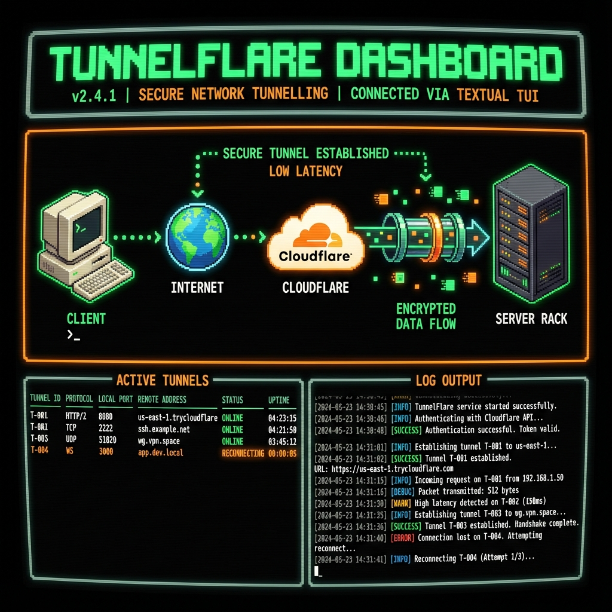

# TunnelFlare


<div align="center">


**Secure Highway to your Private Server.**

</div>

---

**TunnelFlare** is a powerful, visually engaging CLI tool designed to- A Cloudflare account.
- A domain added to your Cloudflare account.
- Python 3.8+
- **Raspberry Pi / ARM**: Fully supported! The installer will automatically detect your architecture and install the correct version of `cloudflared`.
    - *Note: On some Raspberry Pi OS versions, you might need to install `python3-venv` manually if the installer fails: `sudo apt install python3-venv`.*automate and manage Cloudflare Tunnels. It transforms the complex process of exposing local services to the internet into a simple, interactive experience with a retro-hacker aesthetic.

## ✨ Key Features

*   **🚀 Automated Setup**: A guided wizard handles dependency checks, Cloudflare login, tunnel creation, and DNS routing in minutes.
*   **🎨 Retro-Modern UI**: Features a stunning Terminal User Interface (TUI) with retro pixel-art icons, animated packet flows, and high-fidelity graphics.
*   **🩺 Advanced Diagnostics**: Real-time health checks for Internet, Tunnel process, and Local services.
    *   **Log Scanning**: Automatically detects errors in tunnel logs and updates status indicators (Green/Yellow/Red).
    *   **Visual Feedback**: Connection lines blink or break when issues are detected.
*   **🛠️ Interactive Dashboard**:
    *   **Live Status**: Monitor your tunnel's health and traffic in real-time.
    *   **Resource Management**: Add or remove DNS routes instantly via the UI.
    *   **Control**: Start, Stop, and Restart the tunnel directly from the dashboard.
*   **🔒 Secure by Design**: Configuration files are stored securely with restricted permissions (`600`).
*   **🌍 Global Installation**: Install once, run anywhere with the `tunnelflare` command.

## 📸 Screenshots

### Interactive Dashboard


## 📦 Installation

### Install from Release (.deb)

If you downloaded the `.deb` package from Releases:

```bash
sudo dpkg -i tunnelflare_1.0.0_amd64.deb
sudo apt-get install -f  # Fix dependencies if needed
```

This will automatically install `cloudflared` if it's missing.

### Automatic Install (Script)

Run the included installer to set up TunnelFlare globally on your system from source:

```bash
./install.sh
```

This will:
1.  Create a hidden directory `~/.tunnelflare`.
2.  Set up a virtual environment and install dependencies.
3.  Check for and install `cloudflared` if missing.
4.  Create a global `tunnelflare` command.

### Build from Source

To build a `.deb` package yourself:

```bash
./build_deb.sh
```
This will create a `tunnelflare_1.0.0_amd64.deb` file in the current directory.

### Manual Install

1.  Clone the repository:
    ```bash
    git clone https://github.com/senukdias/TunnelFlare.git
    cd TunnelFlare
    ```
2.  Install dependencies:
    ```bash
    pip install -r requirements.txt
    ```
3.  Run via Python:
    ```bash
    python3 main.py [command]
    ```

## 🚀 Usage

### 1. Setup Wizard
Run the interactive setup to create your first tunnel:

```bash
tunnelflare setup
```
*Follow the on-screen prompts to login, name your tunnel, and route a domain.*

### 2. Live Dashboard
Monitor and manage your tunnel with the interactive TUI:

```bash
tunnelflare status
```

### 3. Manage Tunnel
Control the background process:

```bash
tunnelflare start    # Start the tunnel
tunnelflare stop     # Stop the tunnel
tunnelflare restart  # Restart the tunnel
```

### 4. Reset
If you need to start fresh:

```bash
tunnelflare reset
```

## ⚙️ Configuration

The configuration is stored at `~/.tunnelflare/config.yml`. It follows the standard Cloudflare Tunnel configuration format.

Example:
```yaml
tunnel: <UUID>
credentials-file: /home/user/.cloudflared/<UUID>.json
ingress:
  - hostname: app.example.com
    service: http://localhost:8000
  - service: http_status:404
```

## 🤝 Contributing

Contributions are welcome! Please feel free to submit a Pull Request.

## 📄 License

This project is licensed under the MIT License - see the LICENSE file for details.

---
<div align="center">
Made with ❤️ by Senuk Dias
</div>
