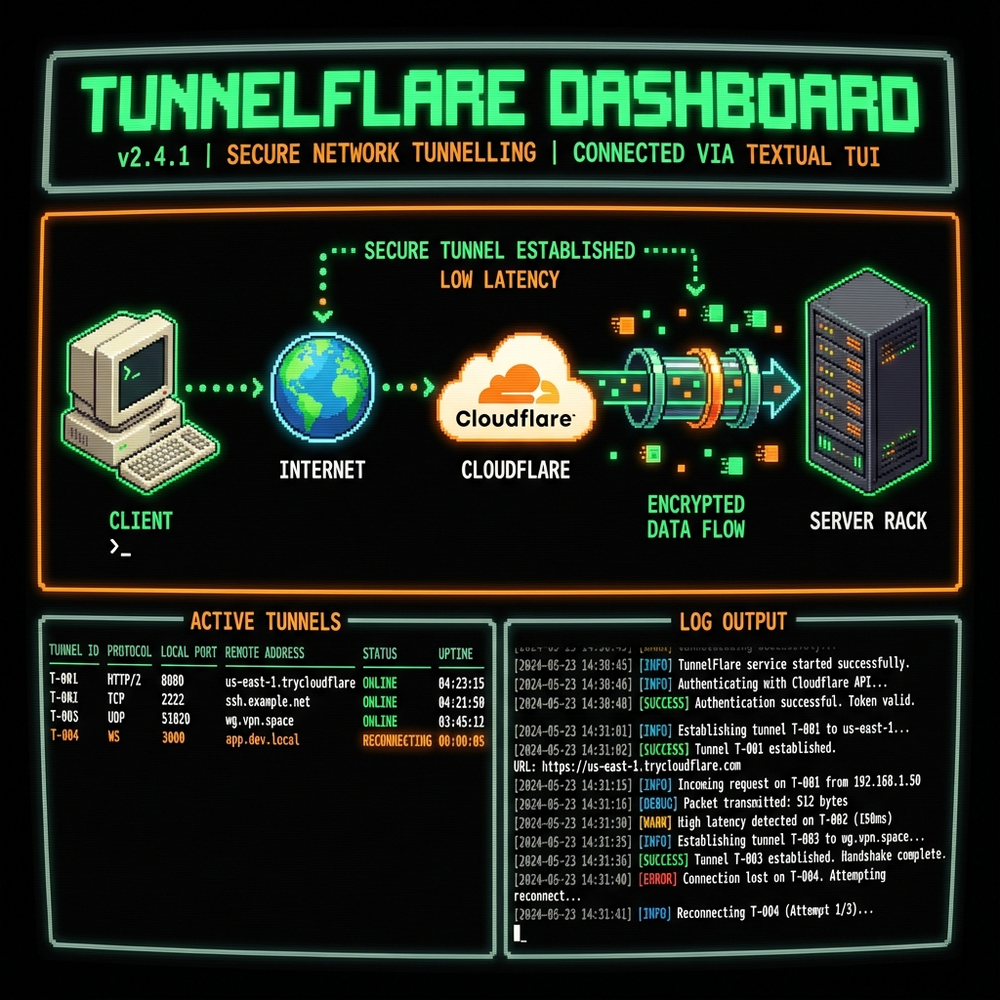

# TunnelFlare v2.0


<div align="center">


**Cloudflare Zero Trust Hybrid Web Mesh & Modern Terminal TUI Orchestrator.**

</div>

---

**TunnelFlare v2.0** is an enterprise-grade, visually stunning Cloudflare Tunnel and Zero Trust Mesh VPN orchestrator. It transforms the complex process of creating secure tunnels and multi-site (client-to-client / site-to-site) private network overlays into an intuitive, high-fidelity experience available both as an **interactive terminal TUI HUD** and a **modern web application**.

---

## ✨ Key Features

* **🕸️ Hybrid Web Mesh Control Plane**:
  * **Interactive Topology Canvas (`React Flow`)**: Visual draggable site cards showing Subnet CIDRs, Public WAN IPs, Physical MAC addresses, and live health status.
  * **Drag-to-Connect Routing**: Connect subnets by dragging a wire between site cards to instantly establish Cloudflare Zero Trust private routes.
  * **Geographic World Map (`Leaflet Dark-Mode`)**: Real-world map with site pins positioned via Cloudflare trace geolocation and animated encrypted QUIC flight arcs.
  * **Real-Time WebSocket Telemetry**: Continuous streaming of RTT latency, jitter, packet loss %, throughput, and edge health.
* **🎨 Retro-Modern Terminal TUI**:
  * 4 responsive station micro-cards (Host, WAN Gateway, Cloudflare Edge, Target Subnet) auto-scaling on window resize.
  * Streaming live log terminal with native scrollbar and intelligent auto-scroll pause/resume.
* **🛡️ Site-to-Site & Client-to-Client Mesh VPN**:
  * Interconnect multiple branch offices or datacenters across Cloudflare Virtual Networks (VNets) without opening public ports.
  * Automated Linux kernel packet forwarding (`net.ipv4.ip_forward=1`) and iptables NAT configuration.
* **🔒 Secure by Design**:
  * API tokens and configurations stored locally with strict `0600` permissions.
  * Atomic file writing to eliminate config truncation.
* **📦 Universal Deployment**:
  * Global CLI tool (`tunnelflare`), self-contained Debian package (`.deb`), and production Docker container (`docker-compose.yml`).

---

## 📸 Screenshots

### 1. Web Mesh Topology Canvas (`React Flow`)
Draggable node-link topology with live latency badges, MAC addresses, and drag-and-drop routing handles:


---

## 🚀 CLI Commands & Usage

TunnelFlare provides a rich CLI suite:

### 1. Web Mesh Dashboard
Launch the browser-based interactive canvas and geographic world map:

```bash
tunnelflare web                  # Starts web control plane on http://localhost:8080
tunnelflare web --port 9000      # Custom port
tunnelflare web --daemon         # Run as background service
```

### 2. Live Terminal TUI HUD
Launch the full-screen terminal status dashboard:

```bash
tunnelflare status
```

### 3. Cloudflare Zero Trust Account Management
Authenticate your Cloudflare account to enable multi-site discovery:

```bash
tunnelflare account login        # Interactive prompt for API token & site name
tunnelflare account status       # View linked account details & token health
tunnelflare account logout       # Remove saved credentials
```

### 4. Zero Trust Mesh Routing
Manage private network subnets directly from the command line:

```bash
tunnelflare mesh list                                # List discovered tunnels & CIDR routes
tunnelflare mesh route-add 192.168.20.0/24           # Route subnet through default tunnel
tunnelflare mesh route-add 10.0.0.0/16 --tunnel <id> # Route subnet through specific tunnel
tunnelflare mesh route-del <route_uuid>              # Revoke a registered route
```

### 5. Standard Tunnel Management
```bash
tunnelflare setup    # Interactive setup wizard with VPN mode selection
tunnelflare start    # Start background tunnel process
tunnelflare stop     # Stop background tunnel process
tunnelflare restart  # Restart tunnel process
tunnelflare reset    # Factory reset configurations
```

---

## 📦 Installation

### Option 1: Automatic Installer (Recommended)

Run the included installer to set up TunnelFlare globally from source:

```bash
./install.sh
```

To automatically enroll a remote branch office into an existing mesh:
```bash
./install.sh --join-mesh --token "<CF_API_TOKEN>" --site "Branch-Office"
```

### Option 2: Debian Package (.deb)

```bash
sudo dpkg -i tunnelflare_2.0.0_amd64.deb
sudo apt-get install -f
```

To build the `.deb` package yourself:
```bash
./build_deb.sh
```

### Option 3: Docker & Docker Compose

Deploy TunnelFlare as a containerized edge gateway:

```bash
docker compose up -d
```

Access the dashboard at `http://localhost:8080`.

---

## ⚙️ Configuration Files

* **`~/.tunnelflare/config.yml`**: Cloudflare Tunnel ingress configuration (mode `0600`).
* **`~/.tunnelflare/account.json`**: Cloudflare Zero Trust credentials & default virtual network (mode `0600`).
* **`~/.tunnelflare/tunnel.log`**: Live daemon logs.

---

## 🤝 Contributing

Contributions are welcome! Please feel free to submit a Pull Request.

## 📄 License

This project is licensed under the MIT License - see the LICENSE file for details.
